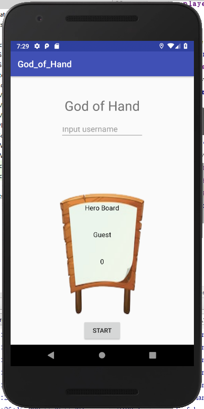
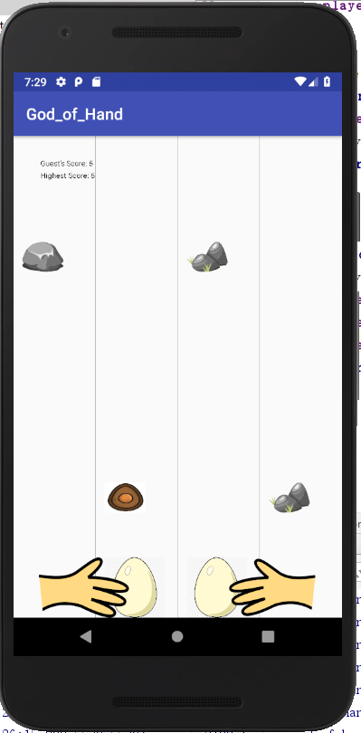

# Retro Game - _God of Hand_

## Team structure and roles 
+ Sukai Huang, u6492211 - Manager, Leader, Logistics
+ Guang Zhu, u6260778 - Software Engineer
+ JiTeng Ma, u6788828 - Framework builder

## Game Overview 

_This is the game in which players need to use two fingers to control eggs to avoid collisions. Players can also collect "egg" props along the way to get some additional effects. Players will receive higher marks if they survive longer._

## Design Documentation 
+ [Design Summary](./Designsummary.md)
+ [UML Diagram](./UML.png)
+ [Testing Summary](./Testingsummary.md)

## Minuted Meetings
+ [Meeting 1 - date - decide team structure and game](./Meeting1.md)
+ [Meeting 2 - date - divide up tasks](./Meeting2.md)
+ [Meeting 3 - date - consider and plan extension aspects](./Meeting3.md)
+ [Meeting 4 - date - review and practice demo](./Meeting4.md)

## Statement of Originality

I _Sukai Huang_ declare that everything I have submitted in this
assignment is entirely my own work, with exceptions given below.

I _Guang Zhu_ declare that everything I have submitted in this
assignment is entirely my own work, with exceptions given below.

I _JiTeng Ma_ declare that everything I have submitted in this
assignment is entirely my own work, with exceptions given below.

### Inspiration

_The game is inspired by a Wechat game called "[神手](https://baijiahao.baidu.com/s?id=1598907121916100562&wfr=spider&for=pc)"_

### Code

_all codes are derived by ourselves_

### Assets 

_[bgm.mp3 - "中国战斗曲 - 曾志豪"](./Assets/bgm.mp3)_

_[centuryegg.png](./Assets/centuryegg.png)_

_[diamondegg.jpg](./Assets/diamondegg.jpg)_

_[egg.jpg](./Assets/egg.jpg)_

_[goldenegg.png](./Assets/goldenegg.png)_

_[lefthand.png](./Assets/lefthand.png)_

_[righthand.png](./Assets/righthand.png)_

_[score_board.png](./Assets/score_board.png)_

_[stone1.png](./Assets/stone1.png)_

_[stone2.png](./Assets/stone2.png)_

_[stone3.png](./Assets/stone3.png)_

_[stone4.png](./Assets/stone4.png)_

_[stone5.png](./Assets/stone5.png)_
