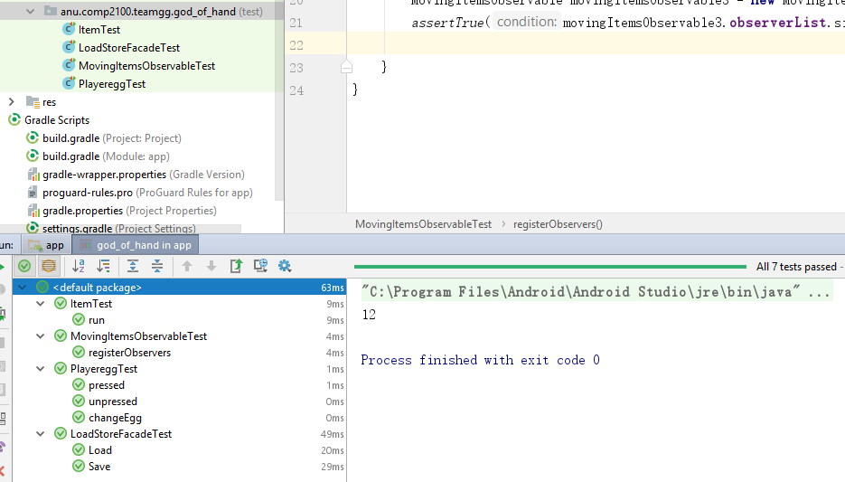
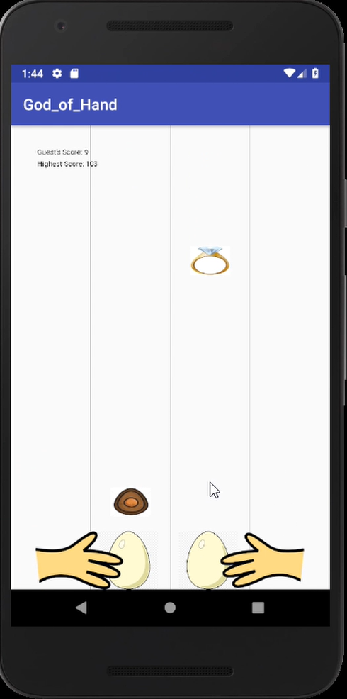
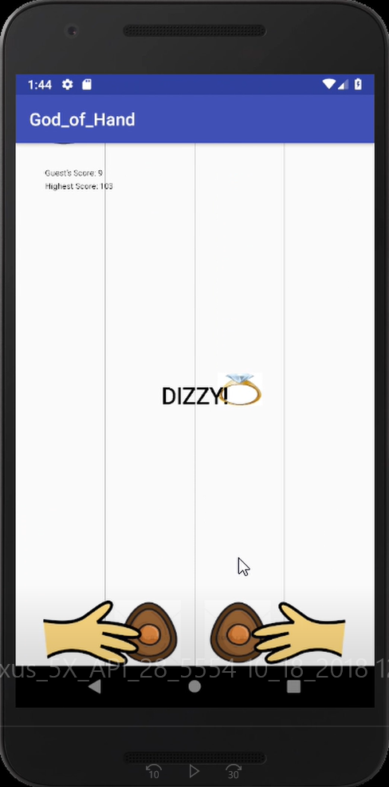
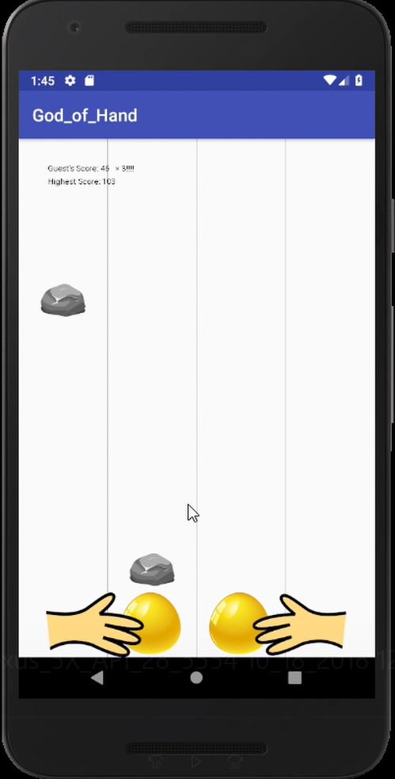
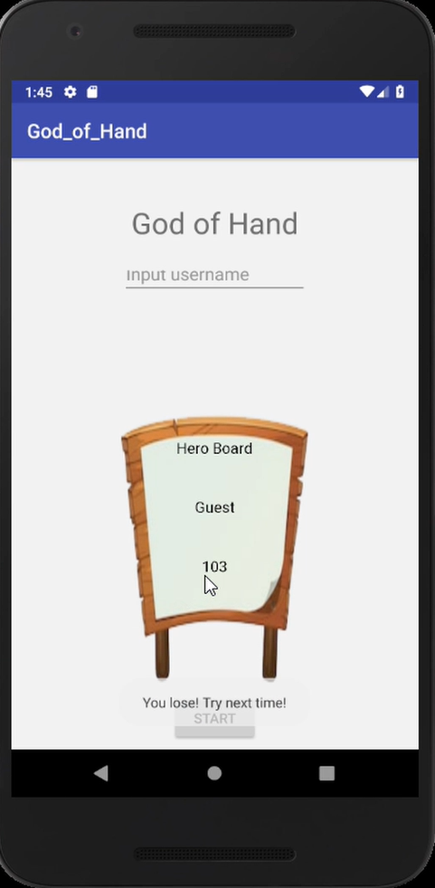
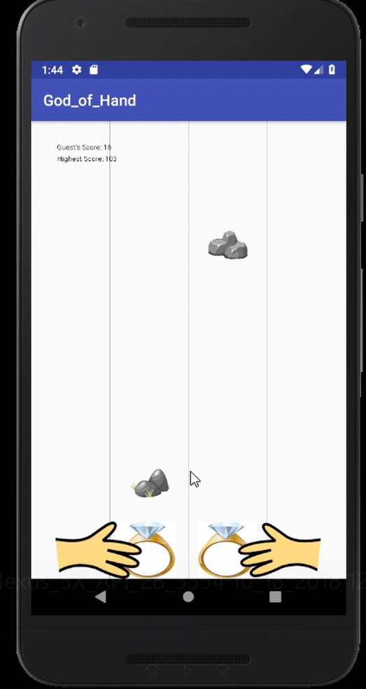
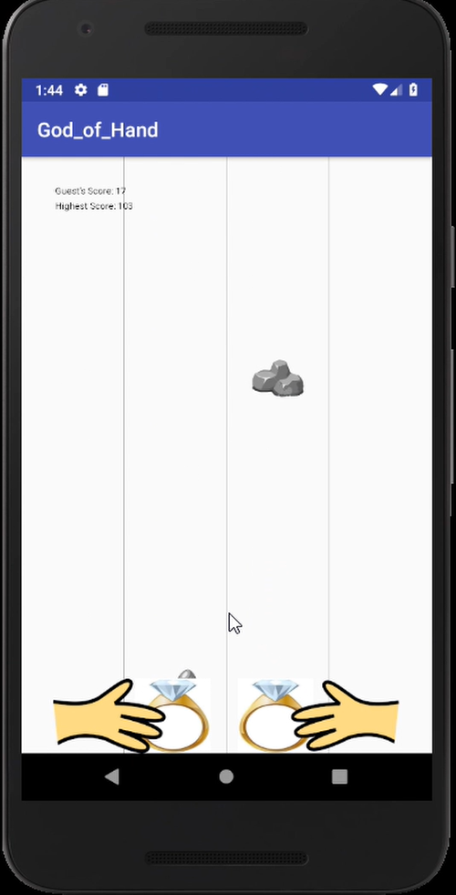
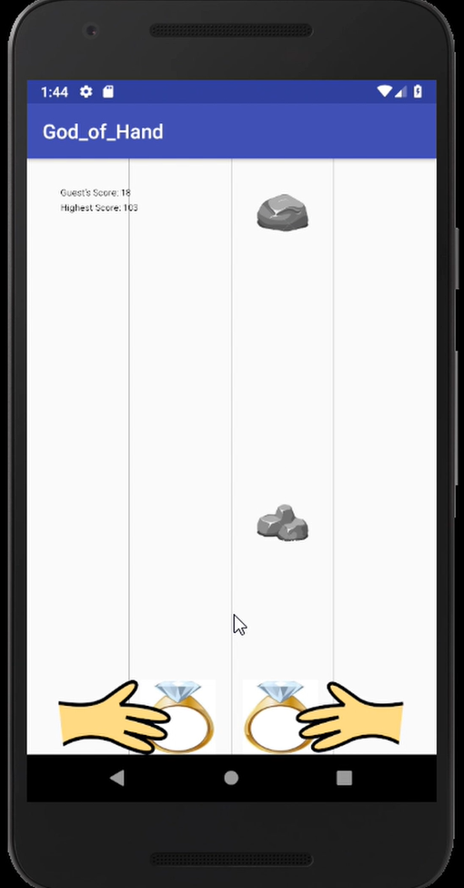
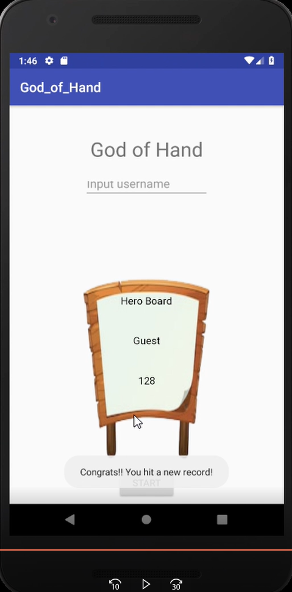

# Retro Game - Testing Summary
## Date
18/10/2018

# White Box testing
We implement 4 White box Junit Testing class for testing "Load and Save" function, "egg press and unpress" function, Observable class and Item interface. 

The result of the testing is shown below 

# Black Box Scenario testing 
In black box testing, we mainly want to test that all the game features are implemented successfully. After goingthrough a bunch of manual testing by all members of the team, the team fix the bugs and ensure that all game features work well.  

## ChangeEggs when collecting egg props 
When hitting an egg prop, the player's egg will change to that egg for a while. 

## End game after colliding with stones 
When hitting a stone, The game will end and the the program will come back to the welcome page with a toast informing players that they lose.

## Invincible when becoming diamond egg 
However, the player is invincible when having a diamond egg 

## A new highest record
When the player hit a new score, They will be informed by a toast

Some of the game features like "blinking" effect can not be shown in image. Thus we cannot present here. Nevertheless, we have tested all of them and all those game features work well. 